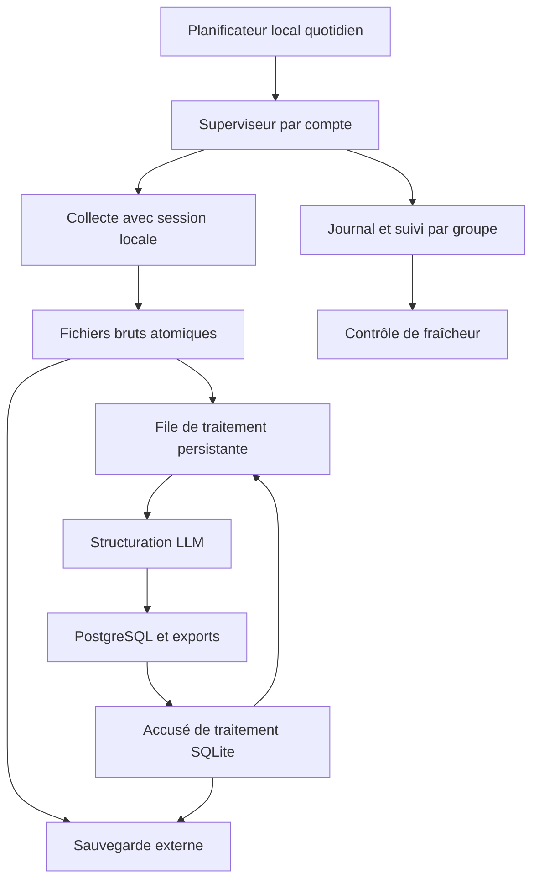

# Ouaga ETL : exploitation pour la soutenance

## Diagnostic vérifié le 8 septembre 2026

Run GitHub 34187517193 : tests réussis ; comptes 1 et 2 en timeout de 20 secondes au contrôle Decodo ; comptes 3, 4 et 5 refusés par le proxy obligatoire absent. Ces erreurs précèdent la collecte : elles ne permettent pas d'attribuer cet échec aux cookies.

La configuration contient 25 groupes attribués, dont **23 actifs** : 5 / 5 / 3 / 5 / 5. Deux groupes du compte 3 sont désactivés. Ne pas les réactiver sans vérifier leur pertinence et l'accès autorisé.

## Architecture livrée



Un répertoire par compte, hors du dépôt, contient raw/, processed/, state/, journal.sqlite3 et status.json. Aucun cookie dans GitHub, ses caches ou ses artefacts. Les fichiers bruts restent disponibles après traitement. SQLite mémorise les fichiers terminés uniquement après réussite ; l'upsert PostgreSQL limite les doublons lors d'une reprise après coupure.

La collecte et le traitement sont exécutés séparément. Une panne Facebook laisse fonctionner le traitement des fichiers déjà présents. Une panne LLM, une erreur de validation, un fichier corrompu ou une panne de base laisse le fichier en attente. Le traitement s'arrête au premier fichier en erreur, afin de borner les appels payants ; réparer ou mettre à part un fichier définitivement corrompu après l'avoir archivé.

Un verrou système empêche deux runs simultanés du même compte, même si GitHub et Windows démarrent ensemble. Les comptes restent indépendants. Un timeout termine le processus et ses enfants. La file et le journal survivent au redémarrage de la machine. Un run interrompu est identifié au passage suivant.

Le rattrapage recherche au moins deux jours, et jusqu'à quatorze selon la dernière collecte terminée. Ce n'est pas une preuve d'exhaustivité : suppression de publications, fil incomplet et plafonds de navigation peuvent laisser des lacunes. Le contrôle des groupes vérifie les passages récents. L'ordre de départ avance après les groupes tentés pour éviter d'oublier toujours les derniers en cas de budget limité.

Un statut « collecte terminée » signifie que le programme s'est terminé sans erreur détectée. Il ne certifie ni exhaustivité ni présence de nouveautés. health.py signale aussi zéro nouveauté à contrôler. Un cooldown retourne désormais un code distinct, jamais un faux succès.

## Installation Windows : actions à effectuer par Yasine

1. Récupérer la branche de correction, puis ouvrir Git Bash dans le dépôt :

```bash
git fetch origin
git switch fix/collecte-durable-sans-proxy
python -m venv .venv
source .venv/Scripts/activate
python -m pip install -r requirements.txt
python -m playwright install chromium
```

2. Compléter le fichier `.env` local en s'appuyant sur `.env.example` **sans écraser un .env existant** :

```dotenv
OUAGA_PERSISTENT_DIR=C:/ouaga-etl-data
DATABASE_URL=VOTRE_URL_NEON
OPENAI_API_KEY=VOTRE_CLE
OUAGA_BACKUP_DIR=CHEMIN_VERS_VOTRE_DISQUE_DE_SAUVEGARDE
```

Ne jamais communiquer ces valeurs dans un chat ou une capture. Aucune variable PROXY_URL n'est nécessaire : les anciennes sont ignorées. Le navigateur et le client LLM sortent directement. Les mots de passe Facebook et la double authentification restent dans le navigateur habituel.

3. Pour chaque compte, se connecter manuellement et exporter ses cookies dans un fichier local protégé. Importer le fichier correspondant, sans l'afficher :

```bash
python scripts/session_local.py --compte 1 --export "C:/chemin-prive/compte1.json"
```

Répéter pour 2 à 5 avec le bon export. L'import vérifie la présence des cookies d'authentification, pas la validité de la session côté Facebook. Les droits Windows du dossier doivent être limités au compte exécutant les tâches. Sur Linux, le fichier est créé avec les droits 0600. Les cookies renouvelés en session sont sauvegardés atomiquement ; un cookie accessoire expiré ne fait plus abandonner une session d'authentification encore valide. Une session invalidée par Facebook demande toujours une reconnexion humaine. L'import ne supprime pas un cooldown.

4. Vérifier un compte puis les autres :

```bash
python scripts/daily.py --compte 1
python scripts/daily.py --compte 2
python scripts/daily.py --compte 3
python scripts/daily.py --compte 4
python scripts/daily.py --compte 5
python scripts/health.py
```

5. Dans PowerShell administrateur, depuis le dépôt :

```powershell
.\ops\install-windows.ps1
```

Entrer le compte et le mot de passe **Windows** dans la fenêtre locale. Ce script crée une tâche de maintenance à 14h (contrôle de fraîcheur + sauvegarde vers OUAGA_BACKUP_DIR) et cinq tâches quotidiennes de 02h à 06h (heure configurée sur Windows), exécutables sans session ouverte. La machine doit rester alimentée et connectée ; un PC éteint ne peut pas collecter. Le réveil dépend du matériel et des réglages d'alimentation. StartWhenAvailable permet de reprendre après une échéance manquée. Vérifier les cinq tâches dans le Planificateur, notamment avec la session Windows fermée. Si la politique PowerShell interdit les scripts, faire autoriser ces fichiers selon la politique du poste.

Les logs de chaque tâche sont dans data/logs/ du dépôt. Contrôler régulièrement leur taille et archiver les anciens. Ne pas activer en parallèle une autre planification non documentée.

## GitHub et hébergement

Les anciens cron de collecte sur machines GitHub temporaires sont retirés **dans cette branche uniquement**. Les tests restent sur GitHub. Un lancement manuel de collecte est préparé pour un runner Linux persistant portant le label ouaga-etl ; il reste désactivé tant que OUAGA_LOCAL_RUNNER_READY n'est pas true. Windows fonctionne indépendamment avec les tâches ci-dessus.

Pour le runner Linux, définir OUAGA_PERSISTENT_DIR comme variable du dépôt, installer un environnement Python dans `$OUAGA_PERSISTENT_DIR/venv`, installer Chromium et ses dépendances, et fournir DATABASE_URL et OPENAI_API_KEY dans l'environnement du service runner. Le stockage doit être hors du répertoire de checkout. Ne pas utiliser simultanément une installation Windows et Linux avec la même session de compte. L'accès runner d'un dépôt public doit être réservé aux workflows de confiance ; aucune PR ne déclenche le job de collecte.

## IP mobiles et cookies

Une carte SIM ne garantit pas une IP publique fixe, ni une IP publique différente de celle d'une autre SIM : les opérateurs peuvent utiliser le CGNAT. Une adresse fixe dépend d'une offre de l'opérateur. Le code ne peut pas attribuer une IP publique mobile à un compte Facebook. Un ordinateur connecté au partage de connexion d'un téléphone utilise la sortie de ce réseau ; ce n'est pas une propriété du user-agent.

Aucune configuration de cinq sorties mobiles n'a été installée. Elle demande du matériel et un service opérateur effectifs. Elle ne résout pas l'expiration des cookies et ne garantit pas l'absence de contrôle. Ne pas acheter cinq abonnements sur cette hypothèse. Cette architecture garde les arrêts en cas de contrôle Facebook ; elle ne tente pas de contourner ces contrôles.

## Exploitation quotidienne et sauvegarde

```bash
python scripts/health.py
python scripts/daily.py --compte 1 --process-only
python scripts/backup.py --destination "E:/sauvegardes-ouaga"
```

La tâche de maintenance garde un code d’échec et un log si le contrôle ou la sauvegarde échoue. Une destination de sauvegarde absente est signalée.

health.py retourne 1 si un compte/groupe est trop ancien (36h), si un incident est connu ou si aucune nouveauté récente ne permet de confirmer la collecte. Il ne transmet pas d'email : prévoir une surveillance externe du PC si une alerte lorsque la machine est éteinte est nécessaire. Son absence ne doit pas être interprétée comme un succès.

backup.py prend les verrous et crée une archive avec les bruts, exports, état non sensible et instantanés cohérents des journaux SQLite. Il refuse implicitement si un compte est occupé : le relancer après les runs. Il exclut cookies et .env. Choisir un autre disque protégé et faire une copie externe quotidienne ; une sauvegarde sur le même disque ne protège pas contre sa panne. Garder les archives pendant les six mois et dimensionner le stockage selon les volumes constatés.

**La sauvegarde locale ne remplace pas une sauvegarde PostgreSQL.** Configurer une sauvegarde de la base et en tester la restauration dans une base distincte. Ne jamais tester la restauration en écrasant la production.

Restauration locale : arrêter les tâches, extraire une archive dans un nouveau répertoire, y pointer OUAGA_PERSISTENT_DIR, réimporter les sessions, puis tester --process-only et health.py. Restaurer raw/ et journal.sqlite3 ensemble. Pour rejouer vers une nouvelle base vide, conserver les bruts mais démarrer avec un nouveau journal de traitement (après archivage du précédent), sinon les fichiers terminés ne seront pas rejoués.

## Préparation de la soutenance

- Première semaine : vérifier chaque compte, les 23 groupes actifs, les volumes et la planification avec session Windows fermée.
- Chaque jour : contrôle de fraîcheur et sauvegarde ; chaque semaine : examiner taux de réussite et lacunes par groupe.
- Chaque mois : restaurer une sauvegarde dans un répertoire/base de test, mesurer le retard et les volumes ; conserver les résultats pour le mémoire.
- Avant la soutenance : figer une version testée et un jeu réel daté, sauvegardé et adapté à la démonstration. Montrer la date des données et les incidents réels. Prévoir une démonstration de reprise sur les données archivées si Facebook est indisponible.

L'objectif défendable est une collecte surveillée, des incidents visibles et une reprise vérifiée. Aucun logiciel ne peut promettre six mois sans blocage d'une plateforme tierce.

## Sources techniques

- https://playwright.dev/python/docs/auth : persistance de l'authentification et sensibilité du fichier de session.
- https://wiki.teltonika-networks.com/view/Private_and_Public_IP_Addresses : différence entre adresse privée/publique et fixe/dynamique.
- https://www.draytek.co.uk/information/blog/what-is-cgnat : partage d'adresse publique, notamment sur réseau mobile.


## Rattrapage des journées manquées

Après configuration des sessions et du fichier .env, lancer dans Git Bash :

```bash
python scripts/daily.py --compte all --backfill-days 8
```

Cette commande traite les comptes successivement, conserve leurs sessions et cooldowns,
relit huit jours sans arrêt aux anciens repères et sans exclusion par les anciens IDs vus.
Les IDs historiques restent conservés. Les annonces déjà présentes sont mises à jour
par leur identifiant dans PostgreSQL ; des appels LLM supplémentaires peuvent en résulter.
Un contrôle Facebook reste un arrêt nécessitant intervention humaine. Le traitement
continue pour les fichiers déjà sauvegardés et les autres comptes.

La fenêtre reste glissante par rapport au moment du lancement. Si le lancement est
repoussé, ajuster le nombre de jours (maximum 14). Les limitations de navigation et les
publications devenues inaccessibles empêchent de garantir une récupération exhaustive.
Pour reprendre uniquement le traitement sans nouvelle collecte :

```bash
python scripts/daily.py --compte all --backfill-days 8 --process-only
```
